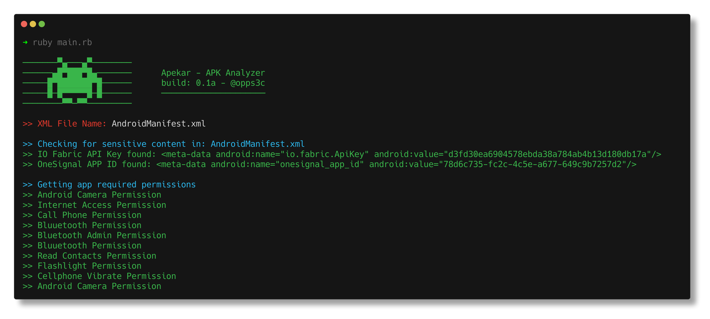

# 👾 Apekar

<div align="center">
    
</div>

<p align="center">
    
    
    
    
</p>

<br>

<p> 👾 <b> Apekar </b> is a Ruby CLI tool to analyze APK files to search for API keys, Secrets, Hosts and detect required permissions by the app. </p>

<br>

## ⚡ Installing / Getting started

<p> A quick guide of how to install and use Apekar. </p>

```
1. Clone the repository - git clone https://github.com/oppsec/apekar.git
2. Install the libraries - gem install colorize
3. Run Apekar - ruby main.rb
```


### 🐳 Docker
If you want to run Apekar in a Docker container, follow this commands:

```
1. Clone the repository - git clone https://github.com/oppsec/apekar.git
2. Build the image - sudo docker build -t apekar:latest .
3. Run container - sudo docker run apekar:latest
```

<br><br>

### ⚙️ Pre-requisites
- [Ruby](https://www.ruby-lang.org/en/downloads/) installed on your machine.
- Install the libraries required with `gem install colorize`

<br><br>

### ✨ Features
- Fast scan
- Low RAM and CPU usage
- Open-Source
- Ruby ❤️

<br><br>

### 📚 To-Do
- [ ] Vulnerability Scanner
- [ ] Support .apk files
- [ ] Detect third-party services
- [ ] Improve code

<br><br>

### 🔨 Contributing

A quick guide of how to contribute with the project.

```
1. Create a fork from Apekar repository
2. Download the project with git clone https://github.com/your/apekar.git
3. Type cd apekar/
4. Make your changes
5. Commit and make a git push
6. Open a pull request
```

<br><br>

### ⚠️ Warning
- The developer is not responsible for any malicious use of this tool.